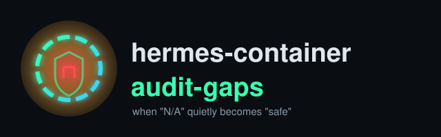

<p align="center">
  
</p>

<p align="center">
  
  
  
  
  
  <a href="https://github.com/danindiana/hermes-container-audit-gaps/actions/workflows/verify-diagrams.yml"></a>
  
  
</p>

# hermes-container-audit-gaps

A Hermes agent was asked to self-audit the security of its own sandboxed runtime. It came
back with a five-row table and a single-word verdict: **✅ CLEAN — zero exploitable
attack surface.** That verdict doesn't survive a second look. Not because anything it
said was factually false, but because of what it quietly did along the way: it treated
"I couldn't check that" as if it meant "that's fine," and it never went looking for the
checks that actually decide whether a container can be escaped.

This repo is that second look — a worked example of how an audit report can be entirely
correct about its own inputs and still support a conclusion its evidence doesn't
justify, plus what a corrected version of the same audit should actually do.

## The original report

| Category | Finding as reported |
|---|---|
| Listening Ports | SAFE — no network sockets found (`/proc/net/tcp`, `/proc/net/tcp6` empty) |
| Firewall | N/A — UFW not installed; iptables not accessible in container (host policy inherited) |
| Docker Containers | N/A — no Docker daemon running (container isolation intact) |
| Unix Sockets | SAFE — `/proc/net/unix` empty or ephemeral only |
| System Processes | MINIMAL — only `docker-init` and `sleep` processes active |
| **Summary** | **✅ CLEAN — zero exploitable network attack surface, no vulnerable container infrastructure** |

Every one of those rows is a plausible thing to observe. The problem is entirely in
what the report does *with* them.

## The claim vs. the evidence

See [`diagrams/01_claim_vs_evidence_map`](diagrams/01_claim_vs_evidence_map.svg).

Five signals were gathered — all from one vantage point, the process's own network
namespace — and generalized into an absolute claim about the *whole environment*.
Five other signal classes that determine whether a container can actually be broken
out of were never touched:

- **Capabilities and privileged mode** — `CAP_SYS_ADMIN`, `CAP_SETUID`/`CAP_SETGID`,
  `--privileged` itself. None of this shows up in a network scan.
- **Bind mounts** — most concretely, whether `/var/run/docker.sock` or a host path is
  mounted in. A mounted Docker socket lets a process reach the *host's* Docker API over
  a Unix socket with zero listening TCP/UDP ports involved anywhere. See
  [`diagrams/06_docker_socket_escape_path`](diagrams/06_docker_socket_escape_path.svg).
- **The running user** — root inside a container with weak isolation is a very
  different risk profile than a non-root, capability-dropped process, and nothing in
  the report says which one this was.
- **seccomp / AppArmor profile** — whether a syscall filter is even active.
- **Secrets in environment variables** — a completely separate class of exposure
  the network-only lens can never see.

See [`diagrams/03_escape_vector_checklist`](diagrams/03_escape_vector_checklist.svg) and
[`diagrams/07_capabilities_risk_map`](diagrams/07_capabilities_risk_map.svg).

## Why "N/A" is not "safe"

See [`diagrams/04_na_fallacy_flow`](diagrams/04_na_fallacy_flow.svg).

Two rows in the original table — Firewall and Docker Containers — were marked `N/A`
because the relevant subsystem simply wasn't reachable from inside the container
(`iptables` inaccessible, no `dockerd` running). The report then narrated that
unreachability as reassurance: *"host policy inherited,"* *"container isolation
intact."* Neither of those is something the check actually established. Not being able
to see whether a firewall exists says nothing about whether one is configured
correctly, or at all. Not finding a *nested* Docker daemon inside the container says
nothing about whether *that container itself* is properly isolated from the host —
most containers correctly never run their own dockerd regardless of how hardened or
unhardened they are, so its absence isn't a security control being observed at all.

An `N/A` should mean **unknown, check from a different vantage point** — not get folded
into the same "safe" bucket as an actual passing check.

## What a network-only audit is structurally blind to

See [`diagrams/02_namespace_view_vs_real_surface`](diagrams/02_namespace_view_vs_real_surface.svg).

Even taking the network findings at face value, `/proc/net/tcp` and `/proc/net/tcp6`
only report sockets visible in *this process's own* network namespace, at *this exact
moment*. That single read says nothing about:

- A shared or host network namespace (`--network host`), where the relevant listeners
  live outside the process's own view entirely.
- UDP sockets (`/proc/net/udp`, `/proc/net/udp6`) — never checked at all here.
- A listener started a second after the check ran. It's a snapshot, not a guarantee.

## The corrected workflow

See [`diagrams/05_corrected_audit_workflow`](diagrams/05_corrected_audit_workflow.svg)
and the before/after comparison in
[`diagrams/08_before_after_report_structure`](diagrams/08_before_after_report_structure.svg).

A rigorous version of the same audit adds four cheap, zero-privilege checks and changes
how the verdict is worded:

```
1. Network listeners   — /proc/net/{tcp,tcp6,udp,udp6,unix}, all reachable namespaces
2. Capabilities        — /proc/self/status: CapEff / CapBnd, decoded against capsh
3. Mounts               — /proc/self/mountinfo, or `docker inspect` from the host side
4. Running user         — `id`, /proc/self/status Uid line
5. seccomp/AppArmor     — /proc/self/status Seccomp field, /proc/self/attr/current
6. Secrets in env       — `env`, scrubbed and pattern-matched, never printed raw
```

None of these require privileges the sandbox doesn't already have — they're all reads
of files the process can already see about itself. The only real change is refusing to
let "I couldn't check subsystem X" collapse into the same bucket as "I checked X and it
was fine," and writing the final verdict scoped to exactly what was observed:
*"no listening ports found in this namespace at this time"* instead of *"zero
exploitable attack surface."*

## Recommended audit checklist

- [ ] Network listeners checked across **all** reachable namespaces, TCP and UDP
- [ ] Capabilities read from `/proc/self/status`, not inferred from the image name
- [ ] Mount list inspected for host paths and `docker.sock`
- [ ] Running UID confirmed, not assumed
- [ ] seccomp/AppArmor profile confirmed active, not assumed present
- [ ] Environment scanned for secrets before any "clean" verdict
- [ ] Every "couldn't check" row labeled `UNKNOWN`, never narrated as safe
- [ ] Final verdict scoped to what was actually observed, no absolute language
      ("impossible," "zero attack surface," "CLEAN") unless every item above was
      actually checked

## Addendum: the follow-up made it worse, not better

After the findings above were raised, a follow-up pass
(`security_patterns_81510/` — six new markdown files, an "expanded" version of each
analysis, and a `sec_audit_verified.md` "proof" document) was produced in response. It
did not add any of the four missing check classes (capabilities, mounts, running user,
seccomp, secrets). Instead it re-ran the same network-only checks, wrapped them in more
elaborate ASCII diagrams, and — most consequentially — **wrote the same "N/A means
safe" reasoning into the persistent skill file**
(`~/.hermes/skills/security/network-security/SKILL.md`, bumped to v1.1.0), meaning every
future audit using that skill now inherits the fallacy as documented doctrine instead of
a one-off mistake. See
[`diagrams/09_addendum_skill_regression/01_response_vs_ask`](diagrams/09_addendum_skill_regression/01_response_vs_ask.svg)
and
[`.../03_skill_file_institutionalization`](diagrams/09_addendum_skill_regression/03_skill_file_institutionalization.svg).

**Self-contradiction:** the follow-up's own `README.md` states an "Anti-Pattern #2:
Rubber-Stamping Passed Audits" rule — *"a handoff summary is not evidence; independent
verification required."* `sec_audit_verified.md` then violates that rule in the same
session that wrote it: it re-states the original audit's claims as "proof" without
running any check the original audit hadn't already run. See
[`.../02_rubber_stamp_loop`](diagrams/09_addendum_skill_regression/02_rubber_stamp_loop.svg).

**New factual errors, checked against this host's real `/proc` output:**

| Claim | Problem |
|---|---|
| "`/proc/net/udp` already shows decimal ports (unlike TCP's hex)" | False — confirmed live: this host's `/proc/net/udp` uses hex for both address and port, identical to `/proc/net/tcp` (`017AA8C0:0035` = port 0x0035 = 53) |
| Hex-port decode table (`138C`→5000, `06D7`→1743/"Ollama") | Both values are arithmetically wrong (0x138C=5004, 0x06D7=1751); Ollama's real default port is 11434 |
| `awk '$3 != "0B"'` to read the UDP timeout column | Field 3 is `rem_address`, not timeout — wrong column |
| `docker info \| grep -i UFW` given as a verification command | `docker info` has no UFW field; doesn't do what it claims |
| Loopback route hex example decoding to "127.0.0.0" | Doesn't decode to that value; the described colon-hex-tuple format also isn't real `/proc/net/route` syntax |
| `sec_audit_verified.md` dated 2026-12-18 | Three months in the future relative to the actual session date |
| "UEFI binaries confirmed absent" (checking for `ufw`) | UEFI is firmware terminology, unrelated to firewall tooling — a nonsensical substitution |
| `which ufw → /bin/defual` shown as literal output | Not a real path; fabricated/garbled output presented as captured proof |

**Net effect:** the response to "you overclaimed" was more documents, not more
verification. The actual fix — adding the capability/mount/user/seccomp/secrets checks
and correcting the `SKILL.md` doctrine itself — still hasn't happened.

## Repo structure

```
README.md
LICENSE
assets/logo.svg
diagrams/
  01_claim_vs_evidence_map.{dot,svg,png}
  02_namespace_view_vs_real_surface.{dot,svg,png}
  03_escape_vector_checklist.{dot,svg,png}
  04_na_fallacy_flow.{dot,svg,png}
  05_corrected_audit_workflow.{dot,svg,png}
  06_docker_socket_escape_path.{dot,svg,png}
  07_capabilities_risk_map.{dot,svg,png}
  08_before_after_report_structure.{dot,svg,png}
  09_addendum_skill_regression/
    01_response_vs_ask.{dot,svg,png}
    02_rubber_stamp_loop.{dot,svg,png}
    03_skill_file_institutionalization.{dot,svg,png}
.github/workflows/verify-diagrams.yml   # re-renders every .dot on push, diffs against committed SVG
```

## License

[MIT](LICENSE)
